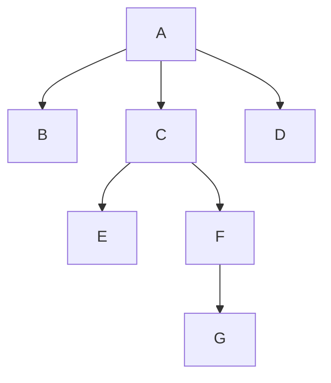
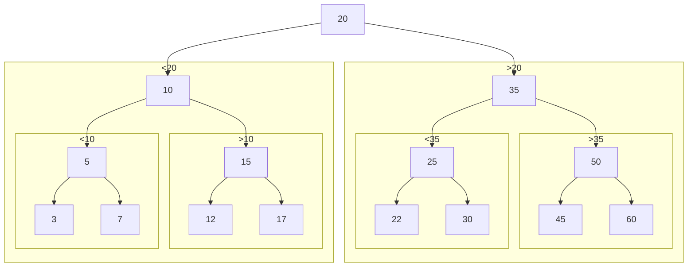
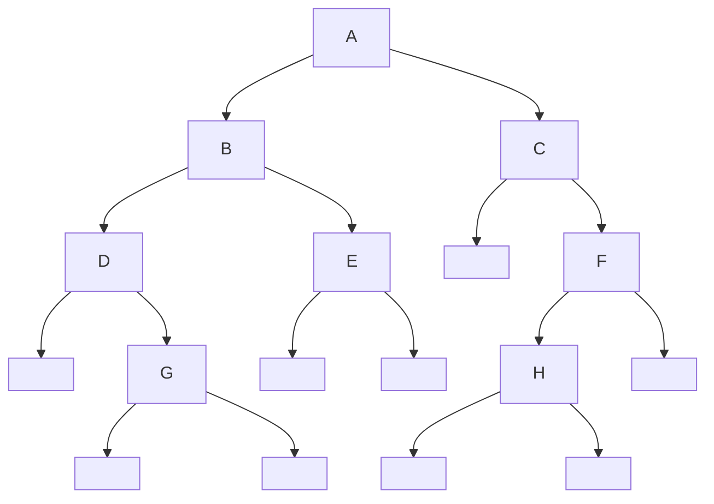
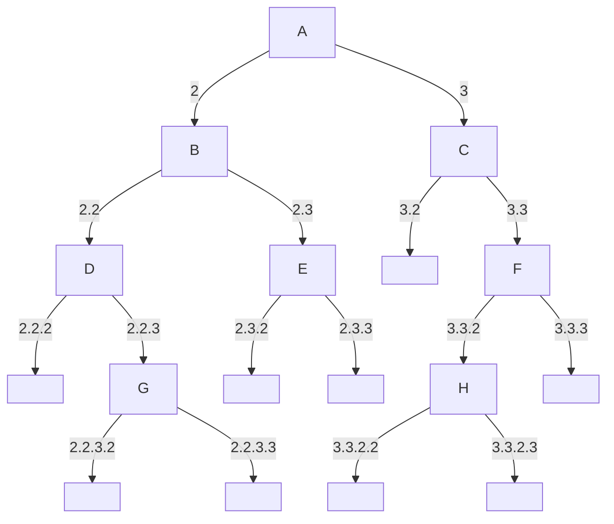

# Spiegazione

Struttura dati ricorsiva NON lineare (a differenza di liste concatenate, pile e code). Lineare = ogni elemento ha UN SOLO predecessore e UN SOLO successore. Il set, pur usando le liste concatenate, concettualmente non è realmente una struttura dati lineare perché gli elementi non hanno una reale relazione di successione tra di loro.

Gli alberi genealogici (visti dalla prospettiva di un unico discendente) non sono lineari perché ogni nodo (ogni persona) ha due predecessori (i genitori) e un successore (il figlio).

Nel caso delle pagine web, per alcune voci nei menu si possono aprire dei sotto-menu e altri sotto-menu a loro volta: anche questa non è una struttura dati lineare, perché alcune voci hanno più "successori".

Questi tipi di strutture dati sono alberi, in particolare quella dell'albero genealogico è un albero binario.

L'albero è un caso particolare di GRAFO, composto da NODI (elementi) collegati tra loro da ARCHI (relazioni) che possono anche essere ORIENTATI (cioè avere un "verso").

Un albero è:
- Vuoto
- Nodo che ha per successori almeno due alberi.



# Definizioni

## Nodi

- Ogni nodo ha, al più, un antenato solo OPPURE tutti i nodi meno uno hanno esattamente un antenato (il _meno uno_ identifica un nodo speciale `A`: il punto d'origine dell'albero, chiamato _radice_ o _root_ in inglese).
- I nodi che non hanno successori (`B`, `D`, `E`, `G`) sono detti _foglie_.
- L'insieme delle foglie (`{B, D, E, G}`)  è detto _frontiera_.
- Tutti i nodi che non sono foglie, compresa la radice (`A`, `C`, `F`), sono detti _nodi interni_ dell'albero.
- Preso un nodo (`C`), ogni nodo ha un _nodo genitore_ o _padre_ (`A`) e _nodi successori_ o _figli_ (`E`, `F`).
- Tutti i nodi che vanno da un nodo (`C`) scendendo lungo i suoi _nodi figli_ (`E`, `F`, `G`) sono detti _discendenti_ e il loro insieme (`{E, F, G}`) è detto _sotto-albero_.
- Tutti i nodi che vanno da un nodo (`C`) salendo lungo i suoi _nodi genitori_ (`A`) sono detti _antenati_.

## Archi e percorsi

- Un collegamento diretto tra due nodi è detto _arco_.
- Un _percorso_ è un insieme di più archi.
- Il percorso che collega un nodo diverso dalla radice a un altro nodo è detto _percorso relativo_.
- Il percorso che collega il nodo radice a un altro nodo è detto _percorso assoluto_.
- Presi due nodi, si può trovare un _percorso minimo_ che li collega.
- Presi due nodi, la loro _distanza_ è il numero di archi che compongono il percorso minimo.
- La distanza di un nodo dalla radice è detta _profondità_.
- La profondità di un albero vuoto, convenzionalmente, viene fissata a `-1`.

## Gradi

- Il _grado_ di un nodo è il numero di figli di un nodo.
- Un _albero di grado $n$-esimo_ è un albero in cui ogni nodo interno ha al più $n$ figli (gli alberi binari sono alberi di grado 2).
- Un _albero di grado $n$-esimo completo_ è un albero in cui ogni nodo interno ha esattamente $n$ figli.
- Un _albero degenere_ è un albero in cui ogni nodo interno ha solo un successore (la lista concatenata è un albero degenere).
- Un albero si dice _ordinato_ quando tra i nodi vige una relazione d'ordine. Esempio relazione `<` (con albero di grado 2 completo):

Osservazione: la relazione d'ordine si mantiene a ogni livello.

## Visite



- L'esecuzione di un percorso lungo un albero viene detta _visita_.
- Una _visita in profondità_ (_depth first visit/search_) è una visita che parte da un determinato nodo (che può essere la radice stessa o un nodo che viene visto come radice del suo sotto-albero) e, per ogni nodo visitato, sceglie il nodo più lontano dalla radice: tra i nodi possibili sceglie il primo, finché non arriva a una foglia e torna indietro alla prima scelta possibile per scegliere un altro.
- Una _visita in ampiezza_ (_breadth first visit/search_) è una visita che parte da un determinato nodo (che può essere la radice stessa o un nodo che viene visto come radice del suo sotto-albero) e, per ogni nodo visitato, sceglie il nodo più vicino alla radice: esplora i nodi in ordine di profondità (prima tutti quelli di profondità 1, poi tutti quelli di profondità 2, ecc.).

### Visita in profondità

La visita in profondità può essere fatta:
- Con una funzione ricorsiva e prende il nome di _visita con backtracking_;
- Con una funzione iterativa e prende il nome di _visita senza backtracking_ servendosi di una [pila (stack)](Pila%20(stack).md).

#### Visita con backtracking

Nella visita con backtracking (visita ricorsiva), ci sono 3 opzioni con gli alberi binari:
- Visita pre-order
- Visita in-order
- Visita post-order

##### Visita pre-order

```
- Stampa nodo
- Visita figlio SX
- Visita figlio DX
```



1) Stampa nodo `A`
2) Visita figlio SX `B`
	2.1) Stampa nodo `B`
	2.2) Visita figlio SX `D`
		2.2.1) Stampa nodo `D`
		2.2.2) Visita figlio SX `NULL`
		2.2.3) Visita figlio DX `G`
			2.2.3.1) Stampa nodo `G`
			2.2.3.2) Visita figlio SX `NULL`
			2.2.3.3) Visita figlio DX `NULL`
	2.3) Visita figlio DX `E`
		2.3.1) Stampa nodo `E`
		2.3.2) Visita figlio SX `NULL`
		2.3.3) Visita figlio DX `NULL`
3) Visita figlio DX `C`
	3.1) Stampa nodo `C`
	3.2) Visita figlio SX `NULL`
	3.3) Visita figlio DX `F`
		3.3.1) Stampa nodo `F`
		3.3.2) Visita figlio SX `H`
			3.3.2.1) Stampa nodo `H`
			3.3.2.2) Visita figlio SX `NULL`
			3.3.2.3) Visita figlio DX `NULL`
		3.3.3) Visita figlio DX `NULL`

Risultato: `A, B, D, G, E, C, F, H`

##### Visita in-order

```
- Visita figlio SX
- Stampa nodo
- Visita figlio DX
```

Risultato: `D, G, B, E, A, C, H, F`
##### Visita post-order

```
- Visita figlio SX
- Visita figlio DX
- Stampa nodo
```

Risultato: `G, D, E, B, H, F, C, A`

### Visita in ampiezza

Svolta solitamente in maniera iterativa e usa come struttura d'appoggio una coda FIFO

# Modifica di un albero

Nell'albero devo dire dove voglio inserire il nodo: per es. nel file system bisogna specificare il path name

# Implementazione

```c
typedef struct node {
	int data;
	struct node *left;
	struct node *right;
} *Tree;

void init_tree(Tree *t) {
	*t = NULL;
}

Tree new_node(int data) {
	Tree new = (Tree) malloc(sizeof(struct node));
	if (new) {
		new->data = data;
		new->left = NULL;
		new->right = NULL;
	}
	return new;
}

void print_pre_order(Tree *t) {
	if (t) {
		printf("%d", t->data);
		print_pre_order(t->left);
		print_pre_order(t->right);
	}
}

void print_in_order(Tree *t) {
	if (t) {
		print_in_order(t->left);
		printf("%d", t->data);
		print_in_order(t->right);
	}
}

void print_post_order(Tree *t) {
	if (t) {
		print_post_order(t->left);
		print_post_order(t->right);
		printf("%d", t->data);
	}
}

// Visita in profondità iterativa
void print_stack(Tree *t) {
	/*
	Alloca stack vuoto
	push(radice)
	while (!empty(stack)) {
		current = pop(stack);
		if (current->left) push(current->left);
		if (current->right) push(current->right)
	}
	*/
}

// Visita in ampiezza
void print_breadth(Tree *t) {
	/*
	Alloca coda FIFO vuota
	enqueue(coda, radice)
	while (!empty(coda)) {
		node = dequeue(coda)
		elabora nodo
		if (node->left) enqueue(coda, node->left);
		if (node->right) enqueue(coda, node->right);
	}
	*/
}

// Aggiunta con percorso
void add_by_path(Tree *t, int data, char* path) {
	if (t) { // Se t ha valore significativo
		if (*t) { // Se non vuoto
			if (*path == '\0') {
				printf("Percorso incompleto, si ferma su un nodo già esistente");
			} else if (*path == 'l') { // Ricorsione verso sx
				add(&((*t)->left), data, path + 1); // Path + 1 == carattere successivo
			} else if (*path == 'r') { // Ricorsione verso dx
				add(&((*t)->right), data, path + 1); // Path + 1 == carattere successivo
			} else printf("Carattere sbagliato nel percorso");
		} else { // Se vuoto
			if (*path == '\0') { // Se è alla fine del percorso
				// Inserisci nodo nuovo
				*t = crea_nodo(data);
			} else printf("Percorso inesistente (troppo lungo)");
		}
	}
}

// Aggiunta con albero ordinato
void add_by_order(Tree *t, int data) {
	if (t) { // Se t ha valore significativo
		if (*t) { // Se non vuoto
			if (data > (*t)->data) {
				add_by_order(&((*t)->right), data);
			} else if (data < (*t)->data) {
				add_by_order(&((*t)->left), data);
			} else printf("Dato già presente nell'albero");
		} else { // Se vuoto
			*t = crea_nodo(data);
		}
	}
}

// Rimozione con percorso
int remove_by_path(Tree *t, int data, char* path) {
	if (t) { // Se t ha valore significativo
		if (*t) { // Se non vuoto
			if (*path == '\0') {
				printf("Percorso incompleto, si ferma su un nodo già esistente");
			} else if (*path == 'l') { // Ricorsione verso sx
				add(&((*t)->left), data, path + 1); // Path + 1 == carattere successivo
			} else if (*path == 'r') { // Ricorsione verso dx
				add(&((*t)->right), data, path + 1); // Path + 1 == carattere successivo
			} else printf("Carattere sbagliato nel percorso");
		} else { // Se vuoto
			if (*path == '\0') { // Se è alla fine del percorso
				// Inserisci nodo nuovo
				*t = crea_nodo(data);
			} else printf("Percorso inesistente (troppo lungo)");
		}
	}
}

// Rimozione ricorsiva di tutto l'albero con visita post-order
void remove_all(Tree *t) {
	if (t) {
		if (*t) {
			remove_all(&((*t)->left));
			remove_all(&((*t)->right));
			free(*t);
			*t = NULL;
		}
	}
}
```