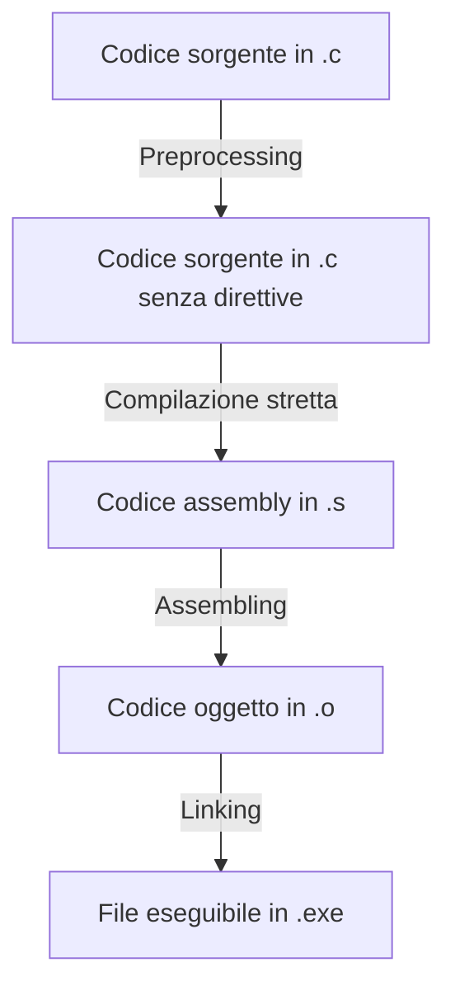

%%Sistemare "formato .c" con "estensione", scrivere "moduli" o "file" nel caso di oggetti in .o ecc.%%

Diviso in 4 step principali:
1. [Preprocessing](#Preprocessing)
2. [Compilazione stretta](#Compilazione%20stretta)
3. [Assembling](#Assembling)
4. [Linking](#Linking)



# Preprocessing

| Input                | Output                                                  |
| -------------------- | ------------------------------------------------------- |
| Codice sorgente `.c` | Codice `.c` con le direttive sostituite da altro codice |

Nella prima fase di compilazione, cioè nella fase di Preprocessing, nel file sorgente in formato `.c` vengono eliminate le direttive `#include` e `#define` e vengono sostituite con altro codice:
- Le direttive `#include` vengono sostituite proprio dal codice a cui fanno riferimento;
- Le macro `#define` sostituiscono le parole chiave (_keyword_) a cui fanno riferimento con i relativi valori dichiarati.

Nel comando
```bash
gcc -E main.c
```
l'opzione `-E` ferma il compilatore dopo la fase di preprocessing e produce il file `.c` con le direttive sostituite.

## Esempio

Un file `vettori.h` contiene il seguente codice:
```c
#define MAX 10
void stampa(int[]);
void inizializza(int[]);
```

Si scrive nel `main.c` il seguente codice:
```c
#include "vettori.h"

int main() {
	int v[MAX];
	inizializza(v);
	stampa(v);
}
```

Durante la fase di Preprocessing, la riga `#include "vettori.h"` viene effettivamente sostituita con il contenuto del file `vettori.h` e il `main.c` diventa:
```c
#define MAX 10
void stampa(int[]);
void inizializza(int[]);

int main() {
	int v[MAX];
	inizializza(v);
	stampa(v);
}
```

E inoltre, con la macro `#define MAX 10`, tutte le parole chiave `MAX` presenti nel codice vengono automaticamente sostituite con `10`, ottenendo il seguente `main.c`:
```c
void stampa(int[]);
void inizializza(int[]);

int main() {
	int v[10];
	inizializza(v);
	stampa(v);
}
```

%% che significa?
1. Si può verificare l’esistenza delle definizioni di funzioni e costanti
2. Si può verificare la correttezza delle invocazioni
%%

# Compilazione stretta

| Input                                                   | Output               |
| ------------------------------------------------------- | -------------------- |
| Codice `.c` con le direttive sostituite da altro codice | Codice assembly `.s` |

La fase di compilazione si occupa di tradurre il file `.c`, in cui sono state eliminate le direttive, in linguaggio assemblativo (_assembly_).

Nel comando
```bash
gcc -S main.c
```
l'opzione `-S` ferma il compilatore dopo la compilazione stretta e produce il file `.s` contenente il codice assembly.

## Esempio

%%Inserire esempio di codice da .c a .s%%

# Assembling

| Input                | Output                   |
| -------------------- | ------------------------ |
| Codice assembly `.s` | Codice file oggetto `.o` |

La fase di assembling si occupa di tradurre il file assembly `.s` in file oggetto `.o` contenente codice binario.

Nel comando
```bash
gcc -c main.c
```
l'opzione `-c` ferma la compilazione alla creazione dei file oggetto corrispondenti alle diverse parti di codice sorgente.
I file oggetto non sono più di tipo testuale e non possono essere visualizzati con un editor.

# Linking


| Input                    | Output                              |
| ------------------------ | ----------------------------------- |
| Codice file oggetto `.o` | File eseguibile (`.exe` su Windows) |

La fase di linking si occupa di compone le diverse parti di codice in un unico programma che può essere caricato in RAM per l’esecuzione.

# Domande

Cosa succede se nella compilazione mi dimentico di specificare tutti i moduli `.c`? E se li specifico ma al loro interno non ci sono collegamenti ai rispettivi header tramite la direttiva `#include`?