Una lista concatenata è una struttura dati lineare, cioè una semplice sequenza di elementi collegati tra di loro.
In realtà, la lista concatenata ha una definizione _ricorsiva_, cioè la definizione di lista concatenata usa se stessa per definirsi:

Una lista concatenata è uno dei possibili tipi di elenco:
1. vuoto;
2. costituito da un elemento seguito da un'altra lista concatenata.

Esempio:
Abbiamo una lista concatenata formata dai seguenti elementi:
- Il primo elemento è in realtà una lista esso stesso ed è costituita dal nodo `A` seguita da un'altra lista (definizione 2);
- La seconda lista è costituita dal nodo `B` seguito da un'altra lista (definizione 2);
- La terza lista è vuota (definizione 1).
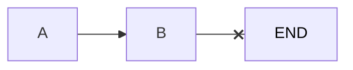

Le opzioni quindi per ogni elemento della lista sono solo 2: o essere un elemento vero e proprio che dovrà essere necessariamente seguito da un'altra lista (altro elemento) o essere vuoto (e quindi non è seguito da nulla e non ha contenuto).

Ogni elemento viene detto _nodo_ ed esso è formato da due parti principali:
- L'informazione che effettivamente deve contenere (es. una stringa, un intero, ecc.);
- Il puntatore al nodo successivo della lista.

# Ruoli degli elementi

A seconda della sua collocazione un elemento ha dei ruoli:
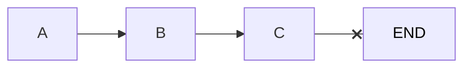
- `A` è il primo elemento della lista ed è il predecessore di `B` e non è successore di alcun elemento;
- `B` è il successore di `A` e il predecessore di `C`;
- `C` è l'ultimo elemento della lista, è successore di `B` e non è predecessore di alcun elemento.

Ovviamente, se una lista ha un solo elemento, il primo elemento e l'ultimo coincidono e non ci sono né predecessori né successori.

# Caratteristiche e proprietà di una lista

Una lista concatenata:
- Può essere ordinata in base a un criterio (es. per ordine alfabetico inverso)
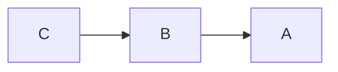
- Può essere non ordinata
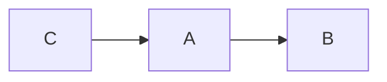
- Lo stesso dato potrebbe comparire più volte
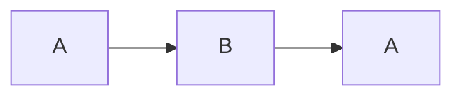

# Operazioni su liste concatenate

- Gli elementi possono essere inseriti o rimossi all'inizio, alla fine o fra due elementi qualsiasi
- Se la lista è ordinata (presenta una certa proprietà), le operazioni che modificano la lista dovranno preservare il suo ordinamento (preservarne la proprietà)
- La lista può essere percorsa per calcolare informazioni (es. calcolare il numero degli elementi oppure somma dei valori contenuti negli elementi in posizione dispari)

Attenzione: quando viene eliminato un nodo, la lista deve rimanere consistente: cioè, il predecessore del nodo che puntava al nodo eliminato deve ora puntare al suo successore, altrimenti la lista è inconsistente.

Oppure, eliminato il primo elemento, dato che è quello puntato dalla variabile che rappresenta la lista, il valore di quella variabile ora deve puntare al secondo elemento, altrimenti non sarà raggiungibile.

%% completare %%

## Eliminazione di un elemento

### Eliminazione del primo elemento

### Eliminazione di un elemento nel mezzo

### Eliminazione dell'ultimo elemento

## Inserimento di un elemento

### Inserimento di un nuovo primo elemento

### Inserimento di un elemento nel mezzo

### Inserimento di un nuovo ultimo elemento

## Cancellazione del primo elemento

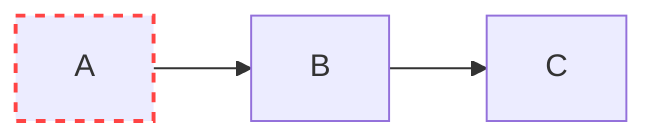

Diventa

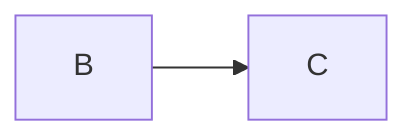

Cioè `B` diventa il nuovo primo elemento della lista

## Cancellazione dell'ultimo elemento

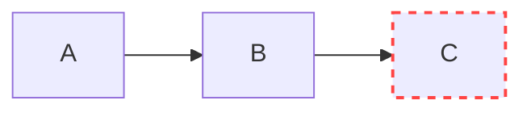

Diventa

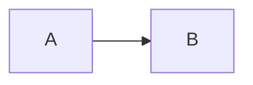

Cioè `B` diventa il nuovo ultimo elemento della lista

## Cancellazione di un elemento nel mezzo

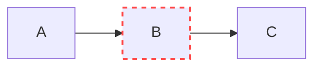

diventa

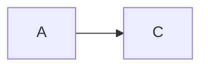

Cioè occorre ricollegare i pezzi rimanenti

## Cancellazione dell'unico elemento

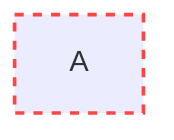

La lista diventa vuota

# Esempio: lista della spesa

 Esempio: una lista della spesa è un elenco di prodotti da comperare, non ordinato e lo stesso elemento potrebbe comparire più volte.
 Gli elementi possono essere inseriti/rimossi all'inizio, alla fine o anche in mezzo a seconda di come ci sembra meglio o di quando vengono trovati in negozio.

Aggiunta degli elementi: mi ricordo che è il compleanno di un’amica, aggiungo una torta
Rimozione elementi:
- Cancello uno o più elementi dati, es. uova, verdura e formaggio
- Cancello tutti gli elementi che godono di una proprietà, es. tutti gli alimenti
- Cancello l’elemento in una posizione (in testa o in coda)

# Lista concatenata in Programmazione

Lista concatenata: sequenza eventualmente vuota di elementi contenuti nell'heap perché la memoria assegnata alla lista viene allocata dinamicamente, ogni elemento ha un riferimento al successivo:

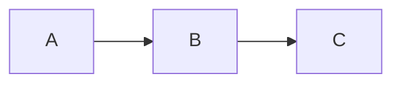

Accesso reso possibile da una variabile (`var`) che punta all'indirizzo del primo elemento della lista:

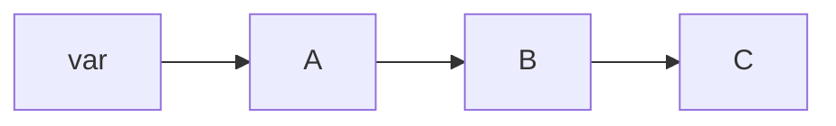

All'inizio la lista è vuota e ho bisogno di un modo per dire che non ci sono elementi: il valore di `var` è `NULL`, cioè non contiene alcun indirizzo di memoria.

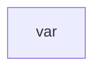

Si inserisce il primo elemento e devo indicare in qualche modo che questo elemento è anche l’ultimo della lista

Poi il secondo, per esempio in fondo (in coda):
- Devo accorgermi che la lista NON È VUOTA
- Devo trovare l’ultimo elemento percorrendola
- Devo creare un nuovo elemento e agganciarlo
- Devo indicare che ora questo è l’ultimo

NULL indica il termine della lista. È importantissimo!!!

Aggiungiamo anche `D`, di nuovo in coda:
- `var` == NULL?
- FALSO, posizionati sul primo elem. della lista (`A`)
- Questo elemento è l’ultimo?
- FALSO, spostati sull'elemento successore (`B`)
- ... così via...
- L’elemento `C` è l’ultimo!
- Crea `D`
- Aggancia `D` a `C`
- Aggiungi che `D` è ora l’ultimo elemento

# Variabile lista

Una lista è una variabile che contiene un riferimento a un nodo oppure `NULL`.

# Nodo di una lista concatenata

Un nodo contiene due informazioni eterogenee:
1. uno o più dati (es. uova, biscotti)
2. un riferimento al nodo successore che può eventualmente essere `NULL` se si tratta dell'ultimo elemento della lista
Il successore sarà dello stesso tipo del nodo considerato.

## Dati di un nodo

I dati possono essere molti, es:
1. dato 1, prodotto da comperare (es. uova)
2. dato 2, quantità (es. 12)

## Dichiarazione di un nodo

```c
struct nodo {
	tipo-dato1 campo-dato1;
	tipo-dato2 campo-dato2;
	...
	tipo-datoN campo-datoN;
	struct nodo *next;
};

struct nodo *vrb;
```

Attenzione: nella dichiarazione del primo nodo della lista (e cioè della lista in generale) viene usato un puntatore e non uno `struct nodo` direttamente perché, nel caso in cui la lista dovesse essere vuota, verrà comunque allocato nella memoria lo spazio necessario per contenere l'intero struct e serve anche una convenzione per determinare poi se la lista è vuota; nel caso del puntatore, invece, basta mettere il puntatore uguale a `NULL`.

Per creare un nuovo nodo: %% a cosa va assegnato? %%
```c
vrb = (struct nodo *) malloc(sizeof(struct nodo));
```

Si può anche usare il `typedef` e fare:
```c
typedef struct nodo *lista;
struct nodo {
	tipo-dato1 campo-dato1;
	tipo-dato2 campo-dato2;
	...
	tipo-datoN campo-datoN;
	lista next;
}

lista spesa = null;
spesa = (lista) malloc(sizeof(struct nodo));

vrb->campo-dato1 = expr;

vrb->next = NULL;
vrb->next->next->next = NULL;
```

## Modificare la testa di una lista

```c
lista L;
```

`L` è la testa della lista. Inizialmente, se la lista è vuota, è `NULL`.

Per cancellare la testa della lista senza perderne il resto, si fa:
```c
vrb = vrb->next;
```

E questo va bene sia se c'è un elemento dopo quello che sarà il nuovo primo, sia se il nuovo primo è anche l'ultimo elemento della lista. Se invece la lista è già vuota e proviamo a fare questa istruzione, ci verrà restituito un errore. Fare quindi un controllo:

```c
if (vrb != NULL) {
	vrb = vrb->next;
}
// else: lista vuota
```

Va però anche liberato lo spazio del nodo che non si usa più perché il C non ha un sistema di garbage collection automatico. Ecco come si fa:

```c
if (vrb != NULL) {
	lista temp = vrb;
	vrb = vrb->next;
	free(temp);
}
// else: lista vuota
```

Dopo `vrb = vrb->next;`, la variabile `temp` punterà ancora al primo elemento della lista, per questo poi possiamo invocare la `free` su di esso. Non possiamo fare `free(vrb)` perché %%spiegare%%. Attenzione a non invertire l'ordine delle istruzioni perché altrimenti %%spiegare%%.

### Funzione per cancellare la testa (versione 1)

```c
int main() {
	lista ml;
	...
	ml = cancella_testa(ml);
}

lista cancella_testa(lista l) {
	lista temp = l->next;
	free(l);
	return temp;
}
```

### Funzione per cancellare la testa (versione 2)

```c
int main() {
	lista ml;
	...
	cancella_testa(&ml);
}

void cancella_testa(lista *l) {
	lista temp = *l;
	*l = (*l)->next;
	free(tmp);
}
```

Nell'invocazione della funzione, scriviamo `cancellatesta(&ml);`, cioè passiamo il puntatore al puntatore della lista. Viene creato quindi il record di attivazione di `cancellatesta` al cui interno c'è spazio per `*l` che avrà come valore l'indirizzo in memoria di `ml` (punterà a `ml`) che a sua volta punta alla lista: `*l` quindi non punta direttamente alla lista, ma punta al puntatore della lista.

Con `lista temp = *l;` andiamo ad assegnare a `temp` la dereferenziazione di `l`, cioè il vero puntatore alla lista.

Perché `(*l)->next` viene scritto con le parentesi tonde? Perché sia l'asterisco `*` che la freccia `->` sono due operatori e, con le parentesi, viene data la priorità all'operatore di dereferenziazione `*` e poi la freccia. Se togliamo le parentesi, non siamo sicuri dell'interpretazione del sistema e non sappiamo con certezza a cosa sarà data la priorità: magari può essere data la priorità alla freccia e poi l'asterisco. Peccato però che, dando la priorità alla freccia, viene cercato un campo `next` (perché `l->next`) che però `l` (che è un puntatore a puntatore a lista) non ha, restituendo errore.

ATTENZIONE A NON MISCHIARE LE DUE VERSIONI!

## Inserimento in testa (versione 1)

Ovviamente vanno aggiunti i test di correttezza dei dati (ma non solo in questo inserimento, anche nelle altre cose)

```c
int main() {
	lista ml;
	lista new = crea_nodo(...);
	ml = aggiungi_testa(ml, new);
}

lista aggiungi_testa(lista l, lista new) {
	new->next = l;
	return new;
}
```

%% far vedere rappresentazione in memoria degli indirizzi %%

## Inserimento in testa (versione 2)

```c
int main() {
	lista ml;
	lista new = crea_nodo(...);
	aggiungi_testa(&ml, new);
}

void aggiungi_testa(lista *l, lista new) {
	new->next = *l;
	*l = new;
}
```

%% far vedere rappresentazione in memoria degli indirizzi %%

# Ricorsione e liste concatenate

Le liste concatenate si prestano a essere manipolate tramite funzioni ricorsive per via della propria natura ricorsiva, cioè per definizione una lista concatenata è uno dei possibili tipi di elenco:
1. vuoto;
2. costituito da un elemento seguito da un'altra lista concatenata.

## Esempio: somma

Voglio calcolare la somma dei valori contenuti nei nodi di una lista concatenata.
```c
int main() {
	// Creazione lista
	lista l = crea_nodo();
	...
	int sum = somma(l);
}
int somma(lista l) {
	if (l == NULL) return 0;
	// Dovrebbe essere corretto anche: if (l->next == NULL) return l->value;
	else {
		return somma(l->value + somma(l->next));
	};
}
```

Procedimento: percorri la lista accumulando i valori via via incontrati.
Caso base: lista vuota, anche il caso base produce un valore.
Passo ricorsivo: somma = valore nodo corrente + somma della lista che lo segue.

Si può fare anche iterativamente es. con un ciclo for.

Fare disegni dei record di attivazione con i colori:


Funzione ricorsiva: restituisce il dato che si vuole calcolare, tra i parametri si mette quel che serve a calcolarlo (in questo caso la lista).

Ovviamente si può usare la ricorsione solo quando tutti i dati sono omogenei.

## Rimozione ricorsiva di una lista

Rimuovere una lista significa non solo togliere degli elementi da essa, ma anche liberare la memoria da essi occupata tramite la funzione `free`.

Versione con parametro passato per riferimento:
```c
int main() {
	// Creazione lista
	lista l = crea_nodo();
	...
	elimina(&l);
}
void elimina(lista *l) {
	if (l && *l) {
		elimina(&((*l)->next));  // Sposto in avanti
		free(*l);  // Libero il nodo (attuale ultimo)
		*l = NULL;  // Segno che dopo non viene più nulla
	};
}
```
`if l` per vedere se il parametro è definito e `*l` per vedere se la lista non è vuota.

La ricorsione viene fatta in testa perché, durante l'esecuzione della ricorsione, prima ci si deve posizionare in fondo alla lista, e poi bisogna cominciare a liberare i nodi a partire dall'ultimo (non possiamo cominciare a cancellare dal primo perché una volta eliminato il primo nodo non sappiamo come raggiungere il secondo). 

%% In `elimina(&((*l)->next));` colorare le tonde e far capire a cosa serve ognuna %%

Versione con parametro passato per valore:
```c
int main() {
	// Creazione lista
	lista l = crea_nodo();
	...
	l = elimina(l);
}
lista elimina(lista l) {
	if (l) {
		l->next = elimina(l->next);
		free(l);
		return NULL;
	};
	else return NULL;
}
```

%% Rivedere le slide, c'è altra roba %%