In generale una lista linkata è uno dei possibili tipi di elenco:
- vuoto
- costituito da un elemento seguito da un'altra lista linkata;
	```mermaid
	graph LR
	    A --> B --> ...
	```
- costituito da un elemento che non viene seguito da altri elementi
	```mermaid
	graph LR
	    A --x 
	```

# Ruoli degli elementi

A seconda della sua collocazione un elemento ha dei ruoli:
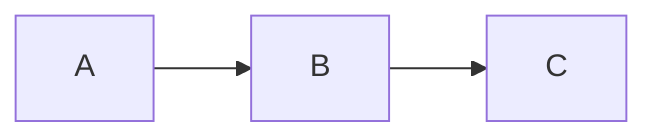
- `A` è il primo elemento della lista, non ha predecessori e il suo successore è `B`;
- `B` è il successore di `A` e il predecessore di `C`;
- `C` è l'ultimo elemento della lista, il suo predecessore è `B` e non ha successori.

# Caratteristiche

Una lista linkata:
- Può essere ordinata in base a un criterio (es. per ordine alfabetico inverso)
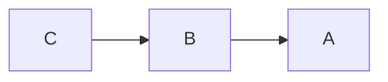
- Può essere non ordinata
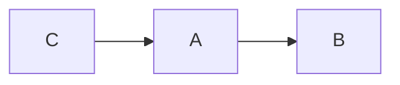
- Lo stesso dato potrebbe comparire più volte
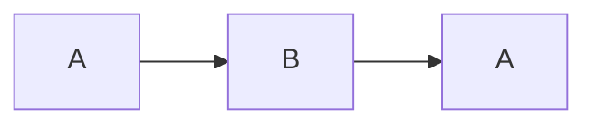

# Operazioni su liste linkate

 - Gli elementi possono essere inseriti o rimossi all'inizio, alla fine o fra due elementi qualsiasi
- Se la lista è ordinata (presenta una certa proprietà), le operazioni che modificano la lista dovranno preservare il suo ordinamento (preservare la proprietà)
- La lista può essere percorsa per calcolare informazioni (es. quanti elementi? Somma dei valori contenuti negli elementi in posizione dispari?)Ri

# Esempio: lista della spesa

 Esempio: una lista della spesa è un elenco di prodotti da comperare, non ordinato e lo stesso elemento potrebbe comparire più volte.
 Gli elementi possono essere inseriti/rimossi all'inizio, alla fine o anche in mezzo a seconda di come ci sembra meglio o di quando vengono trovati in negozio.

Aggiunta degli elementi: mi ricordo che è il compleanno di un’amica, aggiungo una torta
Rimozione elementi:
- Cancello uno o più elementi dati, es. uova, verdura e formaggio
- Cancello tutti gli elementi che godono di una proprietà, es. tutti gli alimenti
- Cancello l’elemento in una posizione (in testa o in coda)

# La cancellazione modifica la lista

## Cancellazione del primo elemento

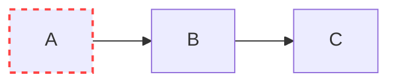

Diventa

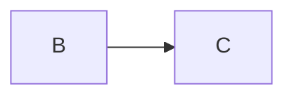

Cioè `B` diventa il nuovo primo elemento della lista

## Cancellazione dell'ultimo elemento

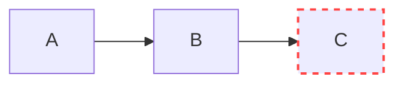

Diventa

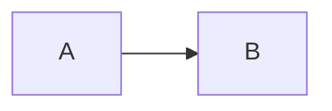

Cioè `B` diventa il nuovo ultimo elemento della lista

## Cancellazione di un elemento nel mezzo

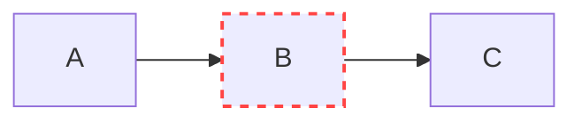

diventa

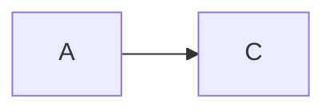

Cioè occorre ricollegare i pezzi rimanenti

## Cancellazione dell'unico elemento

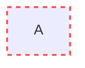

La lista diventa vuota

# Lista in un programma

Lista linkata: sequenza eventualmente vuota di elementi, ogni elemento ha un riferimento al successivo:


Accesso reso possibile da una variabile (`var`):
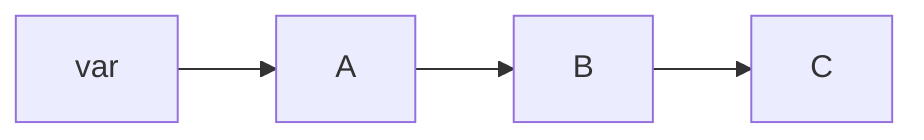

All'inizio la lista è vuota e ho bisogno di un modo per dire che non ci sono elementi
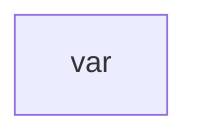

Si inserisce il primo elemento e devo indicare in qualche modo che questo elemento è anche l’ultimo della lista

Poi il secondo, per esempio in fondo (in coda):
- Devo accorgermi che la lista NON È VUOTA
- Devo trovare l’ultimo elemento percorrendola
- Devo creare un nuovo elemento e agganciarlo
- Devo indicare che ora questo è l’ultimo

NULL indica il termine della lista. È importantissimo!!!

Aggiungiamo anche `D`, di nuovo in coda:
- `var` == NULL?
- FALSO, posizionati sul primo elem. della lista (`A`)
- Questo elemento è l’ultimo?
- FALSO, spostati sull'elemento successore (`B`)
- ... così via...
- L’elemento `C` è l’ultimo!
- Crea `D`
- Aggancia `D` a `C`
- Aggiungi che `D` è ora l’ultimo elemento

# Variabile lista

Una lista è una variabile che contiene un riferimento a un nodo oppure `NULL`.

# Nodo di una lista concatenata

Un nodo contiene due informazioni eterogenee:
1. uno o più dati (es. uova, biscotti)
2. un riferimento al nodo successore che può eventualmente essere `NULL` se si tratta dell'ultimo elemento della lista
Il successore sarà dello stesso tipo del nodo considerato.

## Dati di un nodo

I dati possono essere molti, es:
1. dato 1, prodotto da comperare (es. uova)
2. dato 2, quantità (es. 12)

## Dichiarazione di un nodo

```c
struct nodo {
	tipo-dato1 campo-dato1;
	tipo-dato2 campo-dato2;
	...
	tipo-datoN campo-datoN;
	struct nodo* next;
};

// Dichiarazione nodo
struct nodo vrb;
```