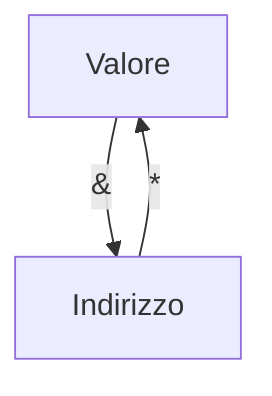

# 1) Paradigma del C

Il C è un linguaggio appartenente al paradigma imperativo, cioè il concetto base del linguaggio è la variabile e l'operazione di base è l'assegnamento a variabile, con il programma che è una sequenza strutturata (strutturata = con strutture di controllo, cicli, ecc.) di istruzioni che operano su variabili.

# 2) Variabile

La variabile è un contenitore di valori ed è alla base del paradigma imperativo. Ogni variabile, generalmente, è composta da 4 elementi:
1. Il nome, cioè l'"etichetta" che identifica la variabile per il programmatore;
2. Il tipo, che ha una doppia funzione: indica sia che cosa rappresenta il dato per il programmatore, sia quanti byte occupa e in che modo sono organizzati;
3. L'indirizzo, che identifica l'area di memoria occupata dalla variabile per l'esecuzione.
4. Il valore, cioè il dato contenuto nell'area di memoria della variabile.

Ogni variabile, in realtà, ha due identificatori: il nome, che la identifica agli occhi del programmatore, e l'indirizzo, che la identifica agli occhi del sistema operativo.

## 2.1) Definizione: L-Value e R-Value di una variabile

Il nome di una variabile può assumere due significati a seconda che si trovi a sinistra o a destra del simbolo `=`:
- A sinistra denota un **_L-Value_**, ovvero rappresenta l'**indirizzo** di una porzione di memoria in cui è possibile scrivere;
- A destra denota un **_R-Value_**, ovvero il **valore** contenuto nella porzione di memoria associato alla variabile.

### 2.1.1) Esempio: assegnazione semplice (solo L-Value)

```c
x = 0
```

In questo caso, `x` è un _L-Value_ e rappresenta solo l'indirizzo di memoria della variabile, cioè l'istruzione si può interpretare come "all'indirizzo di memoria della variabile `x` assegna il valore `0`".

### 2.1.2) Esempio: assegnazione con L-Value e R-Value

```c
x = x + 1
```

In questo caso, la `x` a sinistra dell'`=` è un _L-Value_ e rappresenta l'indirizzo di memoria della variabile, mentre la `x` a destra dell'`=` è un _R-Value_ e rappresenta il valore della variabile. L'istruzione si può interpretare come "all'indirizzo di memoria della variabile `x` assegna il valore di `x` incrementato di 1".

## 2.2) Dichiarazione di una variabile

La dichiarazione di una variabile consiste nell'allocazione in memoria di un determinato numero di byte in base al suo tipo.

L'istruzione di dichiarazione è:
```c
tipo nome-variabile;
```

Per esempio, l'istruzione
```
int x;
```
dichiara una variabile con nome `x` e con il tipo `int` (intero). Ciò significa che la variabile occuperà 4 byte in memoria.

Al momento della dichiarazione, il valore (a meno che non sia già esplicitamente definito) è casuale, perché la variabile ha come valore i bit che le sono stati assegnati, ma nel momento della dichiarazione rimangono i valori precedenti.


Solo dopo un'istruzione di assegnazione i bit non mantengono più i loro valori casuali ma assumono il valore indicato.


## 2.3) Operatori unari per gli indirizzi: `&` e `*`

Per poter operare sul valore dell'indirizzo di una variabile, si usano gli operatori unari:
- `&` (_operatore di referenziazione_) per ottenere l'indirizzo di una variabile (es. con l'istruzione `y = &x` la variabile `y` assumerà come valore il valore dell'indirizzo in memoria della variabile `x`);
- `*` (_operatore di dereferenziazione_) per risalire al valore di una variabile tramite il suo indirizzo (es. con l'istruzione `y = *x`, se `x` contiene il valore di un indirizzo in memoria, allora a `y` verrà assegnato il valore nella cella di memoria indicato da `x`).

%% esplicare esempi con codice, es. con assegnazione a x di un valore come 0x2ddf347 %%



https://www.html.it/pag/15511/dichiarazione-di-variabili-puntatore/

### 2.3.1) Osservazione: combinazione di `&` e `*`

`&(*var) == var`

# 3) Struct

Le strutture (struct, dette anche _record_) in C sono collezioni di dati correlati che possono essere disomogenei (cioè di tipo diverso)

Tipo che identifica una collezione di dati correlati che possono essere disomogenei (`libro` è il _tag_ o _etichetta_ della struttura):
```c
struct libro {
	char titolo[MAXT];
	int pagine;
	char autore[MAXN];
	float prezzo;
};
```

Questo è un prototipo di struttura. Non ha allocata memoria.
In seguito è possibile dichiarare variabili di tipo `struct libro` (è un tipo unico).
Esempio:
```c
struct libro L; 
```

Abbiamo dichiarato una variabile di nome `L` e di tipo `struct libro`.
`struct libro* Lptr = &L;` per il puntatore
`L.pagine = 200;` con l'operatore `.`
`ptrL->pagine = 200;` con l'operatore `->`

Nota: L’operatore `->` permette di accedere più semplicemente alla struct noto il suo puntatore, risparmiando la scrittura (equivalente): `(*ptrL).pagine = 200`

## 3.1) Utilizzo con le funzioni

- Le variabili struct nelle funzioni vengono passate per valore! (come se passassi una variabile di tipo primitivo, es: `int`)
- I membri della struct sono passati nel modo in cui verrebbero passate variabili dello stesso tipo
	- Pertanto la funzione chiamata non modifica la struct nel chiamante! %%ma se vengono passate come le variabili dello stesso tipo, allora non dovrebbero essere modificate se vengono passate per valore?%%
	- Per modificare la struct bisogna passarla per riferimento con l'operatore `&`
- Passare le strutture per riferimento è più efficiente (non occorre la copiatura dell’intera struttura, si lavora direttamente sull'"originale")
- Si può sfruttare questa peculiarità delle strutture per passare ad una funzione un array per valore (se ciò è desiderato), "impacchettandolo" in una struttura!

### 3.1.1) Esempio

```c
void stampalibro(struct libro L) {
	// richiede la copia di sizeof(struct libro) bytes!
}
void stampalibro(struct libro* Lptr) {
	// molto più efficiente
}
```

## 3.2) Padding

I campi hanno dimensione diversa e sono allocati in ordine di specifica nel codice. I sistemi operativi non allocano la memoria a singoli byte, ma a gruppi di 4, 8, 16, ecc. byte. Una struct può avere allocata un po’ più memoria dello stretto necessario per riempire lo spazio rimanente nel "gruppo" di byte (padding).

Inizializziamo uno struct e due elementi P1, P2
```c
struct prova {
	char x;
	char y;
	int z;
} P1, P2;
```
(la parte `struct prova {...}` è letteralmente la parte di dichiarazione del tipo, stessa cosa se al posto di `struct prova {...}` ci fosse `int` che diventerebbe `int P1, P2`). 

### 3.2.1) Osservazione: conseguenze del padding

Notiamo che:
- `sizeof(struct prova) = 8` per il padding (perché il sistema operativo alloca direttamente un gruppo di 8 byte per la struct)
- `sizeof(char)*2 + sizeof(int) = 6` lunghezza effettiva che dovrebbe avere (1 * 2 + 4)

## Assegnazioni e confronti tra strutture

Per copiare due strutture `P1` e `P2` (dello stesso tipo ovviamente) si può anche fare semplicemente
```c
P1 = P2;
```
e in automatico tutti i valori dei campi di `P2` saranno copiati nei campi di `P1`.

Non si può fare invece
```c
if (P1 == P2) {
	...
}
```
perché il C non lo permette %%perché?%%.

## 3.3) Strutture autoreferenziali

Una struct non può contenere un membro del proprio tipo di struct, ma può contenere un puntatore a quel tipo di struct.

Ad esempio:
```c
struct employee {
	char firstName[20];
	char lastName[20];
	struct employee manager;
};
```
NON SI PUÒ FARE, mentre:
```c
struct employee {
	char firstName[20];
	char lastName[20];
	struct employee* managerPtr;
};
```
è un'operazione fattibile.

`struct employee` è detta _struct autoreferenziale_ (_self-referential struct_)

## 3.4) Array di struct

Dichiarazione nutrizionale di un alimento:
```c
struct dich_nutriz {
	int energia;
	float grassi;
	float carboidrati;
	float fibre:
	float proteine;
	float sale;
}
```

Posso costruire tipi di dati/variabili complessi/e, es.
```c
struct cibo {
	char nome[MAX];
	struct dich_nutriz tabella;
} dispensa[MAXD];
```

in dispensa ci sono tanti cibi, mantengo associata a ciascuno la sua dichiarazione nutrizionale (es. per applicazione dietologica)

`dispensa[MAXD]` è un array di struct, ognuna comprende un nome e una dichiarazione nutrizionale (struct annidata)


Nella navigazione all'interno della struttura, parto da quella più generale (`dispensa`) e man mano scendo nello specifico, un po' come la navigazione nel file system.

## 3.5) Codice della Baroglio

```c
#include <stdio.h>
#include <stdlib.h>

/*
	dichiarazione della forma di struct coord (coord = coordinate)
*/
struct coord {
   int x; // ascisse
   int y; // ordinate
};

/*
	funzione che visualizza i campi della struttura passata come argomento
*/
void stampa(struct coord p) {
	printf("\nx=%d\n", p.x); 
	printf("y=%d\n", p.y); 
}

int main() {
	struct coord sstatica; // vrb di tipo struct coord
	// di seguito dichiarazione di un puntatore a struct coord e allocazione
	// dinamica (nell heap) dello spazio necessario a contenere una struct di questo tipo
	struct coord *sdinamica = (struct coord *) malloc(sizeof(struct coord));

	sstatica.x = 10; // inizializzazione dei campi
	sstatica.y = 10; // idem
	stampa(sstatica);

	sdinamica->x =20; // quando la struct è allocata dinamicamente, si usa la notazione ->
	sdinamica->y =20; // invece della notazione . per accedere ai campi (lo vedremo)
	stampa(*sdinamica); // cosa succede se passo sdinamica invece di *sdinamica?

}
```

# 4) `typedef`

Il `typedef` consente di creare sinonimi (o alias) per tipi precedentemente definiti. Esempio:

```c
typedef int Intero;
Intero var = 10;
```

Ho dichiarato una variabile `var` di tipo `Intero` (cioè `int`) e le ho assegnato il valore `10`.

Spesso (ma non solo) usato con le struct, esempio:

```c
typedef struct {
	char titolo[MAXT];
	int pagine;
	char autore[MAXN];
	float prezzo;
} Libro; // nuovo tipo "Libro"
Libro L1, L2; // variabili di tipo "Libro"
```

e in questo caso la struct tag non è più necessaria perché possiamo usare direttamente la parola `Libro` per dichiarare il tipo delle variabili, come abbiamo fatto con `L1` e `L2`.

## 4.1) Convenzione scrittura del nome

Per convenzione, si scrive in MAIUSCOLO la prima lettera dei nomi dei tipi che sono sinonimi di altri tipi, es.
```c
typedef char* Stringa;
```

Dopodichè è permesso scrivere le variabili in minuscolo come al solito, ad esempio:
```c
Stringa s;
Stringa doc[MAXLINES];
int strcmp(Stringa, Stringa);
```

## 4.2) Perché usare `typedef`

Il `typedef` viene usato spesso nelle librerie per "svincolare" il tipo di una variabile usata esternamente dalla libreria dal tipo effettivo usato al suo interno: per esempio, se nella libreria dichiaro un tipo `typedef int num`, coloro che useranno la libreria useranno il nuovo tipo `num` e, se in futuro volessi cambiarlo all'interno della libreria (es. renderlo `double`), posso farlo senza che gli utenti che usano la libreria se ne accorgano o debbano modificare qualcosa: viene reso agnostico.

# 5) `enum`

Permette di definire una lista di valori interi costanti convenientemente rinominati con etichette (univoche), dichiarando solo per la prima etichetta il valore iniziale e, a seguire, le altre etichette avranno valori crescenti di un'unità %%mamma mia come cazzo l'ho scritta 'sta frase%%. Ad esempio:
```c
enum months {JAN = 1, FEB, MAR, APR, MAY, JUN, JUL, AUG, SEP, OCT, NOV, DEC};
/* JAN è 1, FEB è 2, e così via */
```

Convenzionalmente si scrivono le etichette in maiuscolo. Sono un mezzo efficiente (preferibile alle `#define`) per
associare valori interi a dei nomi.

## 5.1) Combinazione di `typedef` ed `enum`

Posso anche combinare `typedef` e `enum`:
```c
typedef enum {OUTOFMEMORY = −1, ALREADYPRESENT, INSERTED} Outcome;
```
Cioè, prima enumeriamo una variabile `outcome` con le tre etichette e, successivamente, la definiamo come un nuovo tipo `Outcome`, che ora è un intero che può valere `-1`, `0` o `1`. Per esempio:
```c
Outcome operazione(...) {
	...
	return OUTOFMEMORY;
}
```
e questa funzione ritornerà il valore `-1` (perché nell'`enum` abbiamo assegnato `-1` all'etichetta `OUTOFMEMORY`).

# 6) `union`

Variabili simili alle strutture, ma che in un dato momento contengono uno solo dei membri specificati entro le parentesi graffe `{}`. Sintassi identica a quella per le strutture, sostituendo la keyword `struct` con la keyword `union`:
```c
union myunion {
	char cval;
	int ival;
	float fval;
} u;
```
LA VARIABILE `u` PUO’ CONTENERE:
- UN CHAR DI NOME `cval`
OPPURE
- UN INTERO DI NOME `ival`
OPPURE
- UN FLOAT DI NOME `fval`

`sizeof(myunion) = max(sizeof(char), sizeof(int), sizeof(float))`

Il dominio dell'unione è l'unione dei domini dei suoi campi

## 6.1) Differenza tra `union` e `struct`

Attenzione alla differenza tra strutture e unioni:


## 6.2) Sintassi

Stessa sintassi e operazioni delle strutture:
```c
union myunion {
	char cval;
	int ival;
	float fval;
} u, *ptru;
u.cval = ’h’;
u.ival = 0xDE4D7E91; /* sostituisce cval! */
ptru = &u;
ptru->fval = 3.14; /* sostituisce ival! */
```
Alla fine delle operazioni, `u` (e il suo puntatore `*ptru`) saranno di tipo `float` e avranno come valore `3.14`.

## 6.3) Unioni e strutture annidate

### 6.3.1) Struttura in un'unione

Nota: come membro di una unione potrei avere una struttura!
```c
union name1 {
	struct name2 {
		int i;
		float f;
	} svar;
	double d;
} uvar;
uvar.svar.i = 1;
```
E cioè, l'unione `name1` può avere solo un tipo di valore alla volta tra la struttura `name2` (e i suoi membri `i` ed `f`) oppure il decimale `d`. Si dichiara quindi una variabile `uvar` di tipo `union name1` e successivamente, con l'istruzione `uvar.svar.i = 1;`, si sceglie di impostare il suo valore come `struct name2` con il valore `float` indefinito e il valore `int` uguale a `1`.

### 6.3.2) Unione in una struttura

Similmente, un'unione può apparire in una struttura:
```c
struct {
	int flags;
	char *name;
	int utype;
	union {
		int ival;
		float fval;
		char *sval;
	} u;
} symtab[NSYM];
```
Questo è un esempio realistico di uso delle unioni per realizzare una "tabella di simboli"

## 6.4) Cosa contengono in un dato istante?

È responsabilità del programmatore tenere traccia di quale sia il tipo attualmente registrato in una unione. Un approccio comune è quello di memorizzare in una variabile il tipo correntemente memorizzato nella unione, tramite ad esempio un piccolo intero con valori definiti tramite enumerazione:
```c
enum Union_Tag {IS_INT, IS_CHAR};
struct TaggedUnion {
	enum Union_Tag tag;
	union {
		int i;
		char c;
	} data;
};
```
SI PARLA IN QUESTO CASO DI UNA "UNIONE ETICHETTATA" (TAGGED UNION)

## 6.5) Esperimento pratico

- Scrivere un semplice programma di test, `unione.c`, copiando le dichiarazioni qui sotto:
	```c
	enum Union_Tag {IS_INT, IS_CHAR};
	struct TaggedUnion {
		enum Union_Tag tag;
		union {
			int i;
			char c;
		} data;
	};
	```
- Scrivere una funzione che, dato un puntatore ad un'unione etichettata, stampa opportunamente il valore in essa contenuto
- Scrivere un semplice main per provarne il funzionamento
- Cosa succede se si prova a estrarre da un'unione un tipo sbagliato?

## 6.6) Riassunto

- Una unione è in pratica una struttura nella quale tutti i membri hanno spiazzamento nullo rispetto alla base e la struttura è sufficientemente grande da contenere il membro più ampio, garantendo il corretto allineamento in memoria per tutti i tipi presenti nella union
- Sono utili in Sistemi Operativi, ad esempio nelle primitive di allocazione dinamica di memoria, oppure nella costruzione di tabelle di simboli di tipo diverso
